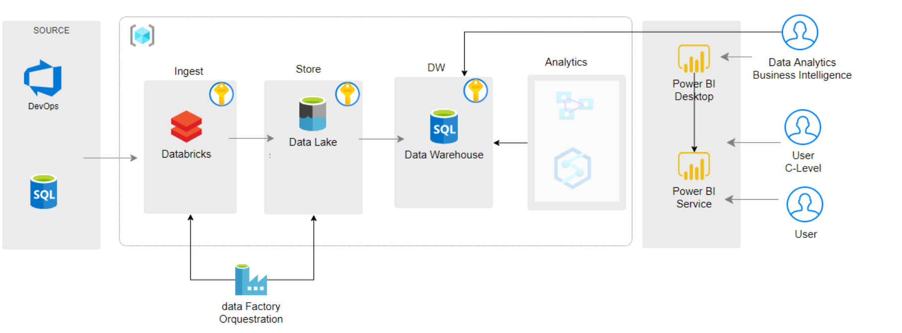

# Azure DevOps Integration Project for Data Lake

This project is a comprehensive integration solution that collects, processes, and stores data from Azure DevOps APIs into an Azure Data Lake, following a three-layer architecture: **Raw**, **Standardized**, and **Consume**. Additionally, it features advanced capabilities like data reprocessing and scheduling in Azure Data Factory.

## Key Features and Qualities

### 1. Data Collection

- Utilizes highly effective Python scripts to extract detailed data from Azure DevOps APIs, including information from the following areas:
  - Work Items
  - Work Item History
  - Board Locations
  - Iterations
  - Processes
  - Projects
  - Teams
  - Users
  - Work Item Links
  - Work Item Revisions

- This makes the project highly flexible and extensible for collecting other types of data if needed.

### 2. Three-Layer Architecture

- **Raw Layer**: In this layer, raw data is stored without alterations, allowing for source data tracking and maintaining data integrity.

- **Standardized Layer**: Data undergoes a transformation and cleaning process in this layer. It is standardized and typed to ensure high quality and ease of use.

- **Consume Layer**: Ready-to-use data is stored here, ready for querying and analysis, saving processing time whenever someone accesses the data.

### 3. Data Reprocessing Capability

- This project has the ability to reprocess data, essential for correcting errors or applying new transformation rules retrospectively. The scripts include a version control mechanism for tracking all changes made to the data.

### 4. Automated Scheduling

- Scheduled to run hourly in Azure Data Factory, the project keeps the data up to date automatically, providing access to real-time information without manual intervention.

## Requirements

- Azure DevOps account with appropriate permissions to access the APIs.

- Security and access configurations for Azure Data Lake.

- An Azure Data Factory environment set up for scheduled execution of the project.

- Python dependencies such as Pandas and PySpark for data processing.

## Execution

The project is configured to run hourly in Azure Data Factory. With each execution, data is collected, processed, and stored in the corresponding layers of the Data Lake, ensuring the availability of up-to-date information.

## API References

- For detailed information on the Azure DevOps APIs used in this project, please refer to the official Microsoft documentation: [Azure DevOps APIs Documentation](https://learn.microsoft.com/en-us/rest/api/azure/devops)

## Architechture

## Contact

For more information about this project and assistance, please contact Diego Mendes Brasil at m.diegobrasil@outlook.com.
